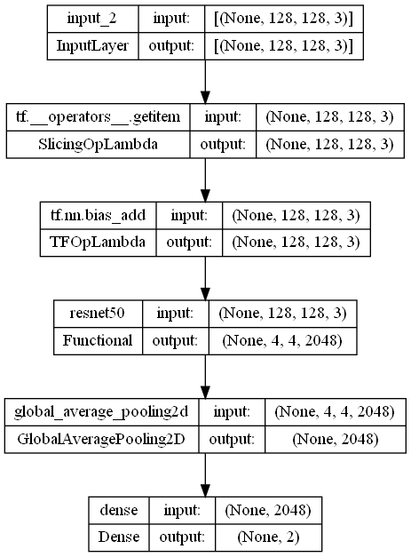

# Concrete Crack Image Classification using TensorFlow (ResNet50)

## 1. Summary
The aim of this project is to create a model that can perform image classification on concrete crack images accurately.

## 2. IDE and Frameworks used
The project is built using the Spyder and Visual Studio Code IDEs for the python (.py) and jupyter notebook (.ipynb) respectively.

The python packages used in this project is [TensorFlow](tensorflow.org) [Keras](https://keras.io/about/), [Matplotlib](https://matplotlib.org/) and [NumPy](https://numpy.org/).

## 3. Methodology

### 3.1 About the Dataset

The dataset contains concrete images having cracks. The data is collected from various METU Campus Buildings.
The dataset is divided into two as 'Negative' and 'Positive' crack images for image classification. 

Each class has 20000 images with a total of 40000 images with 227 x 227 pixels with RGB channels. The [dataset](https://data.mendeley.com/datasets/5y9wdsg2zt/2) was obtained from Data Mendeley. The sample of the datasets are shown below:

The raw images in the dataset are 227 x 227 x 3 pixels. (3 represents the number of channels in a RGB image). 

### 3.2 Data Pipeline
From the dataset, the training and validation data set is split into an 80:20 ratio and 20% of the validation set was set aside for the test data set. I also resized the images to 128 x 128 x 3.

In the data augmentation layer, transformations are applied the training images using rotation and horizontal and vertical flipping to expose the model to different aspects of the training images and reduce overlearning the training data.

In the feature extraction, I created a base model from ResNet50 and excluded the top layer for classification layer. I also froze the convolutional base model before compiling and training.

In the classification layer, I applied a global average pooling layer and a Dense layer of 2 outputs (2 class - 'Negative' and 'Positive') and softmax as the activation function.

### 3.3 Model Structure
For this project, I used ResNet50 as the base model instead of MobileNetV2. Despite being a larger and slower model than the MobileNetV2, i chose it over the latter due to its quality and accuracy. The structure of the model is as shown below:

The model is trained with a batch size of 32 and for 5 epochs. The training stops at epoch 6 after fine tuning the base model layer, with a training accuracy of 99.87% and validation accuracy of 99.95% as shown in the image below:

## 4. Model evaluation
Upon evaluating the model with test data, the model obtained the following test results, as shown in figure below:

# License
Distributed under GNU General Public License v3.0. See [LICENSE](LICENSE) for more information.

## Acknowledgements
-  [TensorFlow - Image Classification](https://www.tensorflow.org/tutorials/images/classification)
-  [MobileNetV2 vs ResNet50](https://analyticsindiamag.com/mobilenet-vs-resnet50-two-cnn-transfer-learning-light-frameworks/#:~:text=As%20we%20can%20see%20in,accuracy%2065%25%20in%20100%20epochs.)
-  Kah Chun Kong - SHRDC Technical Instructor 